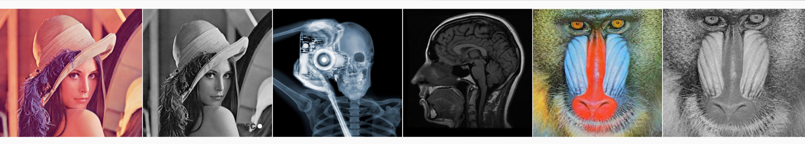

# Restauración de Imágenes con Iluminación No Uniforme

**Autores:**
- Luis Manuel Lagunez Rodríguez      a20216349@alumnos.uady.mx
- Leticia del Carmen Tejero Gamboa   a17001595@alumnos.uady.mx  
- José Luis López Martínez           jose.lopez@correo.uady.mx

 

## Resumen
Este proyecto tiene como objetivo desarrollar y comparar algoritmos para restaurar imágenes afectadas por **iluminación no uniforme**. Se implementaron métodos basados en filtros homomórficos y estimación de funciones de iluminación, utilizando **Python y OpenCV**, evaluando su eficacia tanto en imágenes simuladas como en imágenes reales capturadas con cámara CCD.

El trabajo fue presentado en la **Sociedad Matemática Mexicana**, contribuyendo al desarrollo académico de los autores y formando parte de su historial profesional.

## Motivación y Justificación
La iluminación no uniforme es común en entornos con luz variable o artificial irregular, afectando la calidad visual y la interpretación de imágenes. Restaurar estas imágenes es crucial en aplicaciones como visión por computadora, medicina, vigilancia y fotografía forense.

Abordar este problema desde un enfoque de investigación permite explorar métodos avanzados de procesamiento de imágenes, contribuyendo al **estado del arte** en la restauración de imágenes y ofreciendo soluciones prácticas.

## Metodología
1. **Modelo de iluminación no uniforme**:  
   \[
   g(x, y) = f(x, y) h(x, y) + n(x, y)
   \]  
   - \(g(x,y)\): imagen observada  
   - \(f(x,y)\): imagen original  
   - \(h(x,y)\): función de iluminación no uniforme  
   - \(n(x,y)\): ruido blanco  

2. **Simulaciones con imágenes artificiales**  
   - Modelos de iluminación: gradiente, Lambertiano, distancia euclidiana.  
   - Algoritmos de restauración y preprocesamiento (ecualización de histogramas) implementados en Python con OpenCV.  

3. **Adquisición de imágenes reales**  
   - Captura con cámara CCD en entornos controlados con variaciones de luz.  
   - Aplicación de los algoritmos a imágenes reales para validar su desempeño.  

4. **Evaluación de resultados**  
   - Métricas: **Error Cuadrático Medio (MSE)**, **Relación Señal-Ruido (SNR)**, **Error de Diferencia de Intensidad (EDIF)**.  
   - Comparación visual de imágenes antes y después de la restauración.

## Resultados y Discusión
- Se lograron restaurar imágenes afectadas por iluminación no uniforme tanto en simulaciones como en casos reales.  
- Los algoritmos muestran mejoras significativas en calidad visual, comprobadas con métricas cuantitativas y evaluación cualitativa.  
- La captura de imágenes reales permitió enfrentar desafíos distintos a los de entornos simulados, enriqueciendo el análisis.  

## Presentaciones 
- Trabajo presentado en la **Sociedad Matemática Mexicana (SMM)** en la Ciudad de Durango, octubre de 2024.  
- Trabajo presentado en el **Congreso de Ciencias Exactas de Ingeniería (ConCEI)** en la Ciudad de Mérida, octubre de 2024.

## Conclusiones y Trabajo Futuro
- Los algoritmos implementados son efectivos para restaurar imágenes degradadas por iluminación no uniforme.  
- Se plantea como trabajo futuro la **paralelización de los algoritmos** para reducir complejidad computacional y trabajar con imágenes de mayor tamaño.  
- El proyecto sirve como base para futuros estudios en restauración de imágenes y procesamiento digital avanzado.

## Tecnologías Utilizadas
- **Lenguaje de programación:**
<code></code> 
- **Bibliotecas:**
 <code> </code>
 <code></code> 
- **Cámara:** CDD para adquirir imágenes reales.  

## Referencias
1. Rafael C. Gonzalez y Richard E. Woods. *Digital Image Processing*, Pearson, 4th edition, 2018.  
2. J. L. López-Martínez y Vitaly Kober. *Image restoration of nonuniformly illuminated images with camera microscanning*, SPIE, 2010.  
3. Vijay K. Madisetti y Douglas B. Williams. *Digital Signal Processing Handbook*, CRC Press, 1999.  
4. D. Tomazevic, B. Likar, y F. Pernus. *A comparison of retrospective shading correction techniques*, ICPR-2000.  
5. R. Yam-Uicab et al. *A fast hough transform algorithm for straight lines detection in an image using GPU parallel computing with CUDA-C*, The Journal of Supercomputing, 2017.